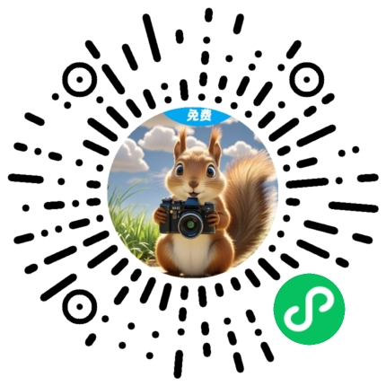
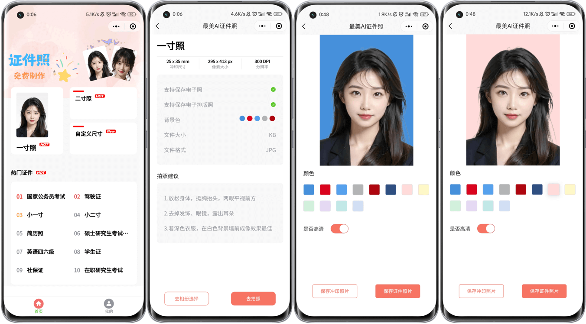

# HivisionIDPhotos-Uniapp

<div align="center">
  
  <h1>《松鼠证件照》</h1>
  <p>基于 HivisionIDPhotos 的智能证件照制作小程序</p>
  
</div>

---

## 📖 项目介绍

本项目基于 [Zeyi-Lin](https://github.com/Zeyi-Lin) 开源的 [HivisionIDPhotos](https://github.com/Zeyi-Lin/HivisionIDPhotos) AI证件照制作算法，使用 **Uniapp** 框架开发的跨平台证件照制作应用。

### ✨ 核心特性
- 🎯 **智能抠图**：基于先进的AI算法，精准识别人像轮廓
- 🎨 **背景替换**：支持多种标准证件照背景色
- 📐 **尺寸定制**：内置常用证件照尺寸，支持自定义规格
- 📱 **多端适配**：支持微信小程序、H5、APP等多平台
- 💾 **本地保存**：一键保存至手机相册
- 🖼️ **排版打印**：生成六寸排版照，方便打印

### 🔗 API对接说明

项目直接对接 [HivisionIDPhotos](https://github.com/Zeyi-Lin/HivisionIDPhotos) 的API服务：
1. 部署并启动 HivisionIDPhotos 后端服务
2. 修改 `src/config.ts` 文件中的 `host` 地址为你的API服务地址
3. 即可开始使用完整的AI证件照功能

#### 正在开发的后台主要是实现：
- 微信小程序用户的登录与管理
- 证件照尺寸列表的管理
- 广告激励管理
- 用户图片下载记录
- 会考虑将图片用对象存储的方式存储，用来提升低带宽服务器的访问速率(可能会是七牛云，因为每个月免费10个G，hhh)

#### Tips:
  后台管理将用Golang实现<br>
  目前开发进度70%<br>
  为什么选用Golang？<br>
  Java太占内存了，我的云服务器内存比较小，运行两个Java项目就给内存吃满了<br>
  用Go可以很好的避免这个问题，一个简单的Go项目，内存占用只有不到20m<br>
  目前还是Golang练习生，一边GPT一边写代码，所以后台写的比较慢 2333
## 🛠️ 技术栈

| 技术 | 版本 | 说明 |
|------|------|------|
| **Uniapp** | 2.0.2+ | 跨平台开发框架 |
| **Vue** | 2.6.14+ | 渐进式JavaScript框架 |
| **TypeScript** | ~4.5.5 | JavaScript的超集，提供类型安全 |
| **Vuex** | 3.6.2 | Vue.js的状态管理模式 |
| **Uview UI** | 2.0.36 | 基于uniapp的UI框架 |
| **Sass** | ^1.78.0 | CSS预处理器 |

> **为什么选择Vue2？** 考虑到Uview UI对Vue3的支持还不够完善，为了确保UI组件的稳定性，暂时采用Vue2版本。

## 🚀 快速开始

### 📋 环境要求

- **Node.js**: >= 16.0.0
- **npm**: >= 8.0.0 或 **yarn**: >= 1.22.0
- **微信开发者工具**: 最新版本（用于小程序开发）

### 📦 安装依赖

```bash
# 使用 npm
npm install

# 或使用 yarn
yarn install
```

### 🔧 配置API地址

修改 `src/config.ts` 文件，设置你的 HivisionIDPhotos API 服务地址：

```typescript
const baseApi: { [key: string]: EnvironmentConfig } = {
  development: {
    host: "http://your-api-server:8080", // 替换为你的API地址
  },
  // ...
};
```

### 🖥️ 开发模式

#### H5 开发
```bash
# 启动H5开发服务器
npm run dev:h5
# 或
yarn dev:h5

# 访问 http://localhost:3000
```

#### 微信小程序开发
```bash
# 编译微信小程序
npm run dev:mp-weixin
# 或
yarn dev:mp-weixin
```

编译完成后：
1. 项目根目录会生成 `dist/dev/mp-weixin` 文件夹
2. 打开**微信开发者工具**
3. 选择「导入项目」，选择 `dist/dev/mp-weixin` 目录
4. 填入你的小程序 AppID（在 `src/manifest.json` 中配置）

### 📱 其他平台开发

```bash
# 支付宝小程序
npm run dev:mp-alipay

# 百度小程序
npm run dev:mp-baidu

# QQ小程序
npm run dev:mp-qq

# 头条小程序
npm run dev:mp-toutiao

# APP开发
npm run dev:app-plus
```

### 🚀 生产构建

```bash
# 构建H5生产版本
npm run build:h5

# 构建微信小程序生产版本
npm run build:mp-weixin

# 构建APP生产版本
npm run build:app-plus
```

## 📁 项目结构

```
HivisionIDPhotos-Uniapp/
├── src/
│   ├── api/              # API接口定义
│   ├── assets/           # 静态资源
│   ├── components/       # 公共组件
│   ├── pages/            # 页面文件
│   │   ├── index/        # 首页
│   │   ├── photo/        # 照片处理页面
│   │   └── mine/         # 个人中心
│   ├── static/           # 静态文件
│   ├── store/            # Vuex状态管理
│   ├── utils/            # 工具函数
│   ├── config.ts         # 配置文件
│   ├── main.ts           # 入口文件
│   └── App.vue           # 根组件
├── dist/                 # 构建输出目录
├── package.json          # 项目配置
└── vue.config.js         # Vue配置文件
```

## 🔧 常见问题

### Q: 编译时出现 webpack 配置错误？
A: 请确保 Node.js 版本 >= 16.0.0，并重新安装依赖：
```bash
rm -rf node_modules package-lock.json
npm install
```

### Q: 微信小程序真机预览时图片无法显示？
A: 请检查以下配置：
1. 确保 API 服务器支持 HTTPS
2. 在微信小程序后台配置服务器域名
3. 检查 `src/manifest.json` 中的 `urlCheck` 设置

### Q: H5 页面在手机端样式异常？
A: 请检查 `src/manifest.json` 中的 `transformPx` 设置，建议设为 `false`

## 🤝 贡献指南

欢迎提交 Issue 和 Pull Request！

1. Fork 本仓库
2. 创建你的特性分支 (`git checkout -b feature/AmazingFeature`)
3. 提交你的修改 (`git commit -m 'Add some AmazingFeature'`)
4. 推送到分支 (`git push origin feature/AmazingFeature`)
5. 打开一个 Pull Request

## 📄 开源协议

本项目基于 [MIT License](LICENSE) 开源协议。

## 🙏 致谢

- [HivisionIDPhotos](https://github.com/Zeyi-Lin/HivisionIDPhotos) - 提供强大的AI证件照算法
- [Uniapp](https://uniapp.dcloud.io/) - 优秀的跨平台开发框架
- [Uview UI](https://www.uviewui.com/) - 精美的UI组件库

## 📞 联系方式

- **邮箱**: soulerror@qq.com
- **GitHub**: [soulerror](https://github.com/soulerror)

---

<div align="center">
  <p>如果这个项目对你有帮助，请给个 ⭐ Star 支持一下！</p>
</div>


